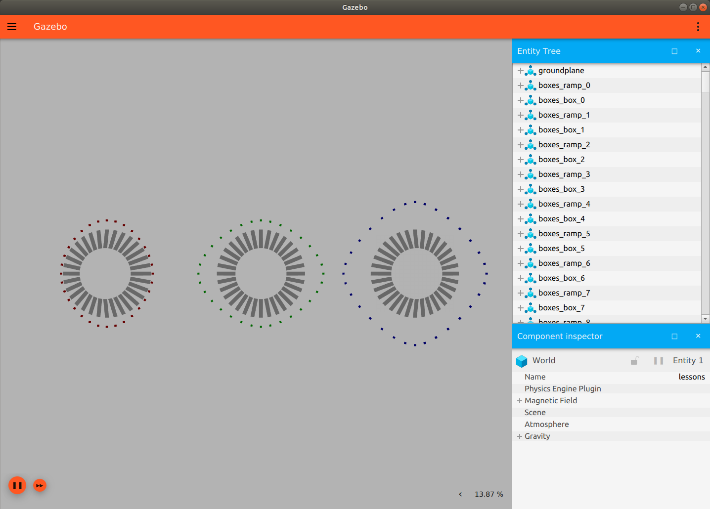

# Friction Pyramid

Both Gazebo and Ignition use a friction pyramid approximation.  

During tests of [friction](../friction/README.md), I noticed that Gazebo and Ignition set the values differently in x and y when using the default world frame. This difference is visualized below by the differences in shape produced from the same simulation description file.

Notably, the ignition simulation produces much smoother results, but it comes at a cost to the real-time factor.
