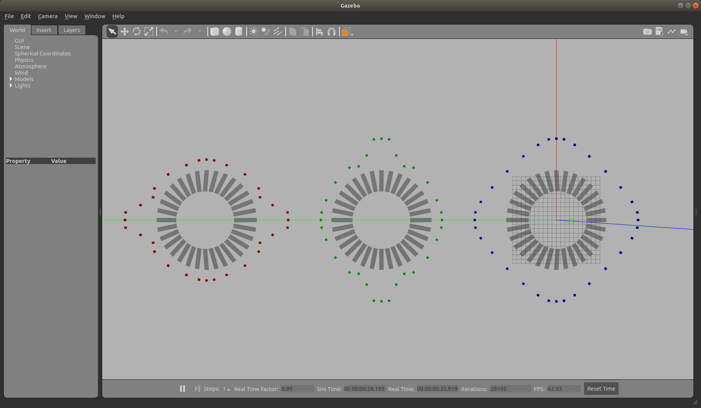

# Friction Pyramid

Both Gazebo and Ignition use a friction pyramid approximation.  

During tests of [friction](/tests/friction/README.md) I noticed that Gazebo and Ignition set the values differently in x and y when using the default world frame which is clearly shown below

Also of note is that while the ignition simulation produces much smoother results, it comes at a cost to the real-time factor.
