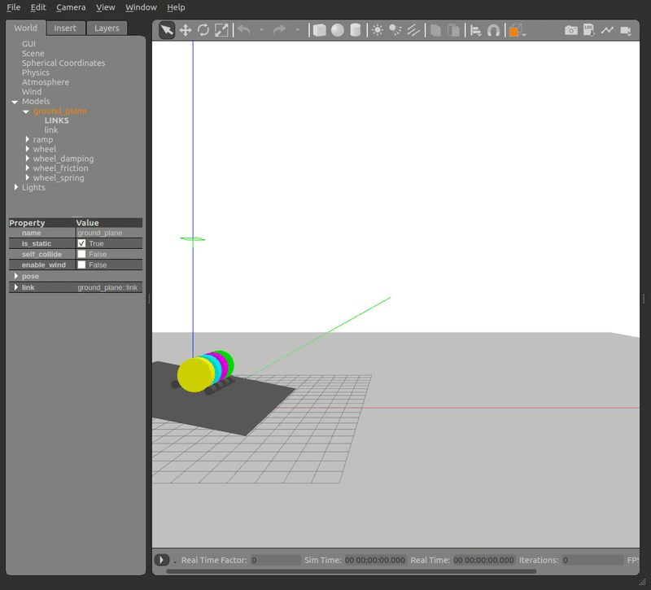
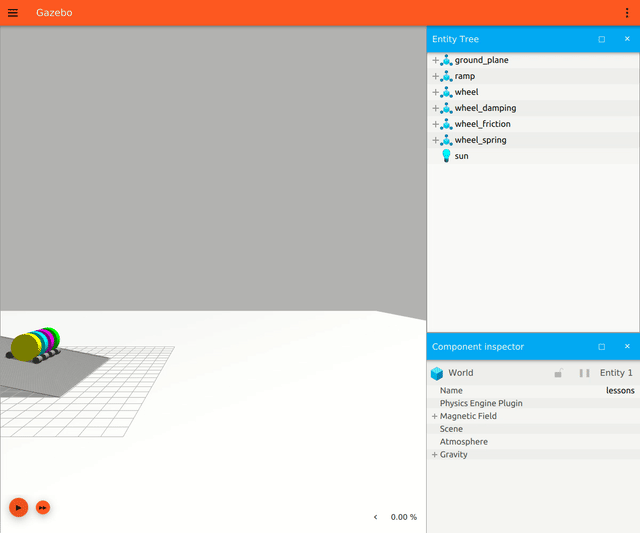

# Wheel Joints

Let's see what [joint damping](../joint-damping/README.md), [joint friction](../joint-friction/README.md) and [joint spring constant](../joint-spring/README.md) act on wheels.

## Comparison

| color  | friction        |
| ------ | --------------- |
| yellow | No dynamics     |
| teal   | Damping         |
| pink   | Friction        |
| green  | Spring constant |
